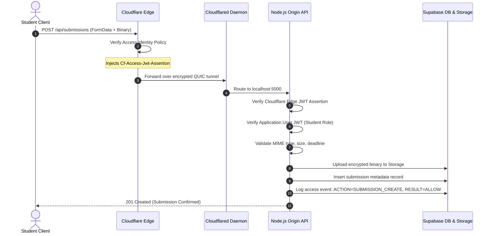
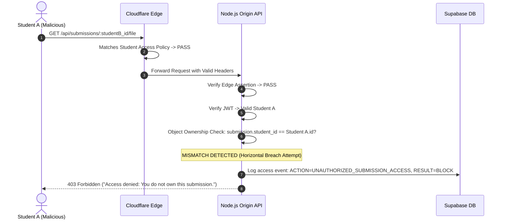
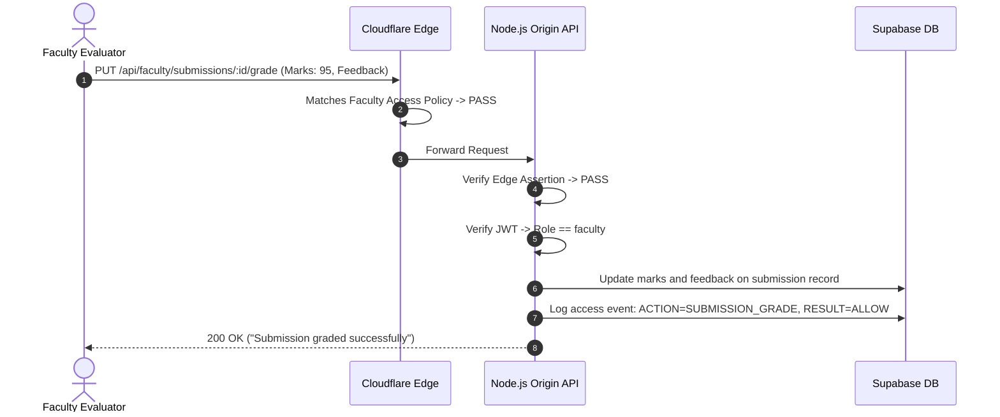

# Zero Trust System Architecture & Defense-in-Depth Specification

This document provides a comprehensive technical breakdown of the architectural paradigms, security controls, and boundary enforcement layers implemented in the **ZeroTrust Academic Assignment Gateway**.

---

## 1. Zero Trust Architectural Principles (NIST SP 800-207)

The system is designed in strict compliance with the **NIST Special Publication 800-207** Zero Trust Architecture framework:

1. **All data sources and computing services are considered resources.**
2. **All communication is secured regardless of network location.** (Local network is untrusted by default).
3. **Access to individual enterprise resources is granted on a per-session basis.**
4. **Access is determined by dynamic policy**—including client identity, role, and continuous verification.
5. **The enterprise monitors and measures the integrity and security posture of all owned and associated assets.**
6. **All resource authentication and authorization are dynamic and strictly enforced before access is allowed.**
7. **The enterprise collects as much information as possible about the current state of assets, network infrastructure, and communications to improve security posture.**

---

## 2. Two-Tier Defense-in-Depth Topology

The architecture completely decouples **network/application ingress** from **fine-grained resource authorization**:

```
+-----------------------------------------------------------------------------------------+
|                                    INTERNET CLIENT                                      |
|                       (Students, Faculty Evaluators, Administrators)                     |
+-----------------------------------------------------------------------------------------+
                                             |
                                             v
+-----------------------------------------------------------------------------------------+
|                         TIER 1: CLOUDFLARE ZERO TRUST (EDGE LAYER)                       |
|                                                                                         |
|  * Anycast DNS & Edge TLS 1.3 Termination                                               |
|  * Volumetric DDoS Scrubbing & Web Application Firewall (WAF)                            |
|  * Cloudflare Access (Identity Perimeter Barrier):                                      |
|      - Unauthenticated User       --> BLOCKED AT EDGE (Prompts IdP / OTP Authentication) |
|      - Rogue / Unauthorized Email --> BLOCKED AT EDGE (403 Forbidden)                    |
|      - Authorized Academic User   --> ALLOWED + Injects Cryptographic Headers:           |
|                                       * Cf-Access-Jwt-Assertion                         |
|                                       * Cf-Access-Authenticated-User-Email               |
+-----------------------------------------------------------------------------------------+
                                             |
                   (Encrypted Outbound-Only QUIC/HTTP2 Tunnel - 0 Open Ports)
                                             v
+-----------------------------------------------------------------------------------------+
|                      TIER 2: NODE.JS EXPRESS ORIGIN (APPLICATION LAYER)                  |
|                                 (http://localhost:5000)                                 |
|                                                                                         |
|  * Edge Verification Middleware (cloudflareAccess.middleware.js):                       |
|      - Cryptographic signature check on Cf-Access-Jwt-Assertion                          |
|  * Continuous Authentication (auth.middleware.js):                                      |
|      - Application JWT signature, issuer, and 24h expiration check                       |
|  * Fine-Grained Role-Based Access Control (role.middleware.js):                         |
|      - Student cannot invoke Faculty APIs (BLOCK 403)                                    |
|      - Faculty cannot invoke Admin APIs (BLOCK 403)                                      |
|  * Strict Object Ownership Boundary (submission.service.js):                             |
|      - Student A cannot view/download Student B's submission (BLOCK 403)                 |
|  * Tamper-Evident Access Auditing:                                                       |
|      - Every ALLOW, BLOCK, and FAILURE event logged with IP, role, and action            |
+-----------------------------------------------------------------------------------------+
                                             |
                                             v
+-----------------------------------------------------------------------------------------+
|                        TIER 3: SECURE DATA & STORAGE INFRASTRUCTURE                     |
|                                                                                         |
|  * Supabase PostgreSQL 15+ (Relational tables: users, assignments, submissions, logs)   |
|  * Supabase Encrypted Object Storage (Private isolated assignment binaries)             |
+-----------------------------------------------------------------------------------------+
```

---

## 3. Sequence Workflows

### 3.1 Coursework Submission Flow (Student - Authorized)



### 3.2 Unauthorized Horizontal Privilege Attempt (Student vs. Student)



### 3.3 Faculty Evaluation & Grade Assignment



---

## 4. Security Enforcement Responsibility Matrix

| Threat Vector | Mitigation Layer | Mechanism | HTTP Status |
| :--- | :--- | :--- | :--- |
| **Port Scanning / Origin Reconnaissance** | Cloudflare Tunnel | No open ports at origin; outbound QUIC only | Connection Refused |
| **Unauthenticated User Ingress** | Cloudflare Access | Default-Deny edge policy blocks access | 302 Redirect / 403 |
| **Unauthorized Email Identity** | Cloudflare Access | Email domain / user list verification | 403 Forbidden |
| **Stolen Perimeter Session / Bypass** | Node.js Middleware | Origin validates `Cf-Access-Jwt-Assertion` cryptographic signature | 401 Unauthorized |
| **Tampered / Expired Application Token** | Node.js Middleware | Cryptographic verification of application JWT (HMAC-SHA256) | 401 Unauthorized |
| **Vertical Privilege Escalation (Student $\rightarrow$ Faculty API)** | Node.js RBAC | `requireRole('faculty')` route guard | 403 Forbidden |
| **Vertical Privilege Escalation (Faculty $\rightarrow$ Admin API)** | Node.js RBAC | `requireRole('admin')` route guard | 403 Forbidden |
| **Horizontal Privilege Escalation (Student $\rightarrow$ Student File)** | Node.js Service Layer | Object-level identity comparison (`user.id === submission.student_id`) | 403 Forbidden |
| **Malicious File Injection** | Multer Middleware | Strict MIME-type filter (PDF, ZIP, DOCX, Code) & 25MB file size limit | 400 Bad Request |
| **Repudiation / Covert Tampering** | Audit Model | Immutable append-only audit trail capturing every ALLOW, BLOCK, and FAILURE | Logged to Database |
